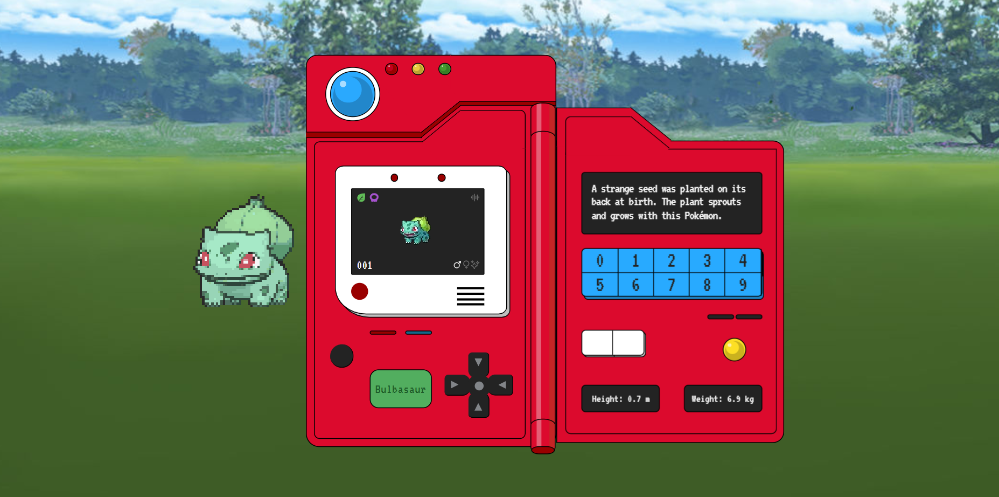

<div align="center">
  
</div>
<h1 align="center">
  Pokedex
</h1>
<p align="center">
  A pokedex that lists all pokemon and their descriptions.
</p>
<p align="center">
  

  

  <a href="https://vercel.com/eriikgabriel/pokedex" target="_blank">
    
  </a>
</p>



## 🧪 Technologies

This project was developed using the following technologies:

<a href="https://nextjs.org/" target="_blank">
    
</a>
<br>
<a href="https://www.typescriptlang.org/" target="_blank">
    
</a>
<br>
<a href="https://tailwindcss.com/" target="_blank">
    
</a>
<br>
<a href="https://zod.dev/" target="_blank">
    
</a>

## 🛠️ Installation and Setup

1. Clone the repository

   ```sh
   git clone https://github.com/EriikGabriel/pokedex.git
   ```

2. Access the folder.

   ```sh
   cd pokedex
   ```

3. Install dependecies:

   ```sh
   bun i
   ```

4. Start the development server:

   ```sh
   bun dev
   ```

   The app will be available for access on your browser at http://localhost:3000

## 🚀 Project Deploy

This project was deployed on the [Vercel](https://vercel.com/) platform and can be accessed [here](https://pokedex-eriikgabriel.vercel.app).

---

_Developed by [Erik Gabriel](https://github.com/EriikGabriel) 🚀_
